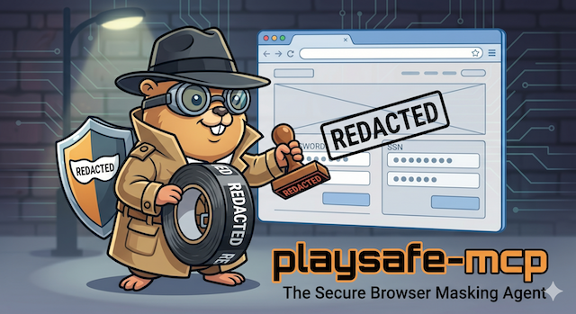

# Playsafe-mcp



When using AI agents to explore websites, there is no guarantee that they won't interact with unsafe elements. **Playsafe** allows sensitive or dangerous elements to be masked from the agent so that they don't know they exist and aren't able to interact with them.

## Overview

`playsafe-mcp` is a **stdio MCP server** built with TypeScript and [Playwright](https://playwright.dev/). It exposes a set of browser-control tools to AI agents, while enforcing a configurable safety layer that:

- **Hides** masked elements from screenshots and the page snapshot.
- **Removes** masked elements from returned page HTML.
- **Blocks** any interaction (click, fill, hover, select) that targets a masked element.

## Installation

```bash
npm install
npm run build
```

## Configuration — masking unsafe elements

Pass one or more `--mask <CSS selector>` arguments when starting the server. Any element that matches a masked selector will be completely invisible to the agent.

```jsonc
// Example MCP client configuration (e.g. Claude Desktop, VS Code, etc.)
{
  "mcpServers": {
    "playsafe": {
      "command": "node",
      "args": [
        "/path/to/playsafe-mcp/dist/index.js",
        "--mask", ".delete-button",
        "--mask", "#admin-panel",
        "--mask", "[data-dangerous]"
      ]
    }
  }
}
```

Multiple `--mask` flags are supported. Standard CSS selectors are accepted (class, ID, attribute, pseudo-class, etc.).

## Available tools

| Tool | Description |
|------|-------------|
| `browser_navigate` | Navigate to a URL |
| `browser_screenshot` | Take a screenshot (masked elements hidden) |
| `browser_snapshot` | Get a structured DOM snapshot (masked elements excluded) |
| `browser_get_page_content` | Get full page HTML (masked elements removed) |
| `browser_click` | Click an element (blocked for masked elements) |
| `browser_fill` | Fill a form field (blocked for masked elements) |
| `browser_select_option` | Select a `<select>` option (blocked for masked elements) |
| `browser_hover` | Hover over an element (blocked for masked elements) |
| `browser_wait_for_selector` | Wait for an element to appear |
| `browser_traverse_history` | Navigate back or forward in browser history |
| `browser_close` | Close the browser |

## How masking works

1. **Screenshots** — a `<style>` tag is injected before the screenshot is captured that sets `visibility: hidden` on all masked selectors, then removed afterwards.
2. **Page content** — a DOM clone is made and all masked elements are removed from the clone before returning the HTML string.
3. **Interactions** — before any click/fill/hover/select, the server checks whether the target element matches (or is a descendant of) any masked selector. If it does, the tool returns an error and takes no action.

## Development

```bash
npm run build   # compile TypeScript → dist/
npm run dev     # watch mode
```
